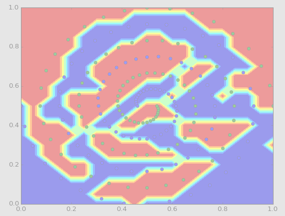
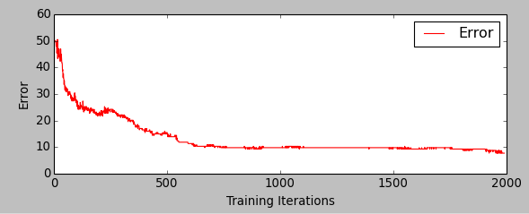
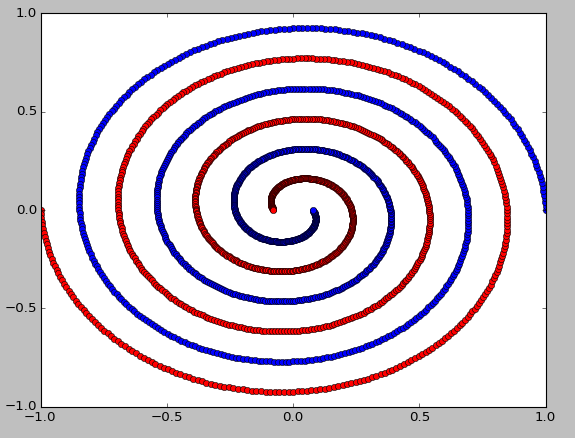
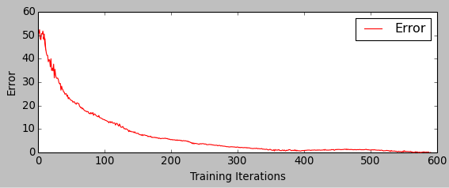
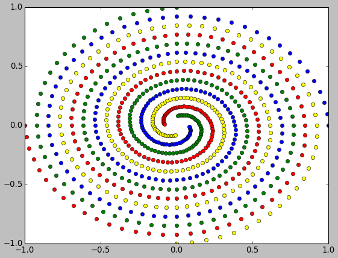
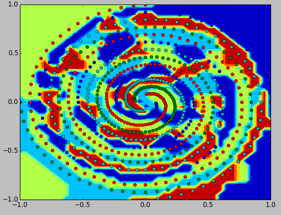
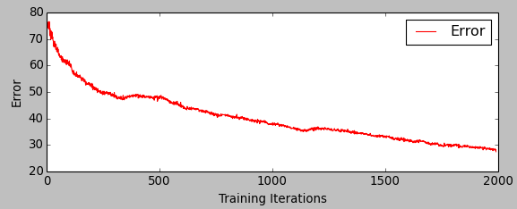

# Q1 Variations of the Two-Spiral Task

## a) Original Dataset

### Steps

1. data obtained from [http://wiki.cs.brynmawr.edu/?page=TwoSpiralsProblem](http://wiki.cs.brynmawr.edu/?page=TwoSpiralsProblem)
    1. version on blackboard did not contain class identifiers
    2. according to the code in the [original paper](http://www.researchgate.net/publication/269337640_Learning_to_Tell_Two_Spirals_Apart), this seems to be the correct format
2. converted spaces to tabs
3. processed with Pybrain ([pybrain-classify.py](pybrain-classify.py))
    1. followed [tutorial](http://pybrain.org/docs/tutorial/fnn.html)
    2. used two binary output neurons (``dataset._convertToOneOfMany(bounds=[0.,1.])``)
    3. used ideas from [Beherey et al.](http://www.hindawi.com/journals/acisc/2009/721370/)
        1. network layout: 2 hidden layers with 77 neurons each
        2. activation: tanh for hidden layers, linear for output
        3. RPROP as training algorithm, because it converges faster than back propagation
 
### Result

- reproduce by running [pybrain-classify.py](pybrain-classify.py)
- visualization of final result not available (plot stopped responding)
    - 
- training error achieved after 5000 epochs: 0.52% (1 misclassified)
    - 

## b) Self-generated dataset

### Steps

1. generated data set using algorithm in blackboard 
    - 
    1. far denser spirals
    2. 1920 (10x as many) data points
2. trained feed-forward net with same characteristics as in a) on new data

### Result

- 10 times as many data points leads to longer training times per epoch
- faster conversion
    - zero classification errors after 598 epochs
    - 
- smoother learning curve
    - 

## c) Four Spirals

### Steps

1. adapted spiral generation script to generate two additional spirals (rotated 90 degrees against original ones)
    - 
2. trained feed-forward net with same characteristics as in a) (but 4 classes instead of only two) on new data

### Result

- due to time constraints canceled training after 2000 epochs
    - classification error at this point: 28.42%
    - 
    - 
- up to this point promising: with enough time, the ANN should hopefully generalize

## d) ANNs vs SVMs

### General Discussion

- as discussed in class, SVMs can be seen as a generalisation of neural networks
    - with a good kernel, the spiral data can be transformed into a linearly separable form
    
### Results

- as suggested in the background reading paper, we used radial basis function kernels
- far lower training times than ANNs for the spiral task